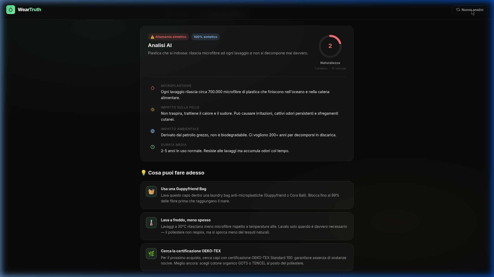
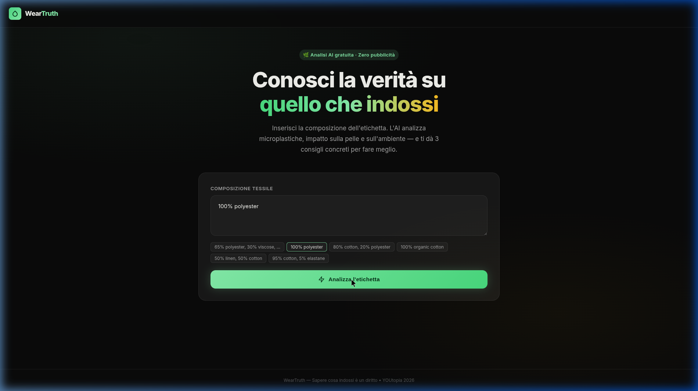

# 🌿 WearTruth

**Conosci la verità su quello che indossi.**

WearTruth analizza la composizione tessile della tua etichetta e ti restituisce un'analisi completa su microplastiche, impatto sulla pelle, impatto ambientale e durabilità — con 3 consigli pratici per fare scelte migliori.

> Progetto realizzato per **YOUtopia 2026** — hackathon dedicato alla creazione di un mondo migliore.

---

### 📸 Screenshots

| Homepage | Risultati (100% polyester) |
|---|---|
|  |  |

---

## 💡 Il problema reale

Compri una maglietta. L'etichetta dice *"65% polyester, 30% viscose, 5% elastane"*. E poi?

- **Non sai** che rilascerà ~700.000 microplastiche ad ogni lavaggio
- **Non sai** che il polyester è derivato dal petrolio e non si biodegrada per 200+ anni
- **Non sai** che esistono certificazioni (OEKO-TEX, GOTS) che garantiscono tessuti più sicuri

Le informazioni esistono, ma sono sparse tra paper scientifici, report ECHA, e siti specializzati. **Nessuno le mette insieme in un formato comprensibile in 2 secondi.**

WearTruth risolve questo: copi l'etichetta, ricevi la verità.

<!-- 👉 Marco: aggiungi qui la tua storia personale se vuoi. Es:
"Ho passato una sera intera a cercare cosa significasse la composizione
della mia felpa preferita. Ho pensato: se è così difficile per me che
so programmare, come fa mia nonna?" -->

---

## 🚀 Come funziona

1. **Copia l'etichetta** del tuo capo d'abbigliamento (es. `65% polyester, 30% viscose, 5% elastane`)
2. **Incollala** nel campo di testo
3. **Ricevi** un'analisi AI con punteggio di naturalezza (1-10), dettagli su microplastiche/pelle/ambiente, e 3 consigli strutturali

## 🏗️ Architettura

```
Frontend (React + Vite)
    │
    ├── compositionCache.json  ← 15 composizioni curate (hit istantaneo)
    │
    └── /api/analyze  ← Vercel Serverless Function (proxy)
            │
            └── Groq API (llama-3.1-8b-instant, JSON mode)
```

### Decisioni tecniche chiave

| Decisione | Motivazione |
|---|---|
| **Serverless proxy** | API key mai esposta nel bundle client-side |
| **`response_format: json_object`** | Groq garantisce JSON valido server-side — zero parsing failures |
| **Cache curata** | Le 15 composizioni più comuni restituiscono dati verificati manualmente da fonti ECHA e OEKO-TEX, senza chiamata API |
| **`llama-3.1-8b-instant`** | Sub-1s latency, ~6000 RPM free tier, nessun rischio timeout Vercel Hobby (10s) |
| **Tips strutturali** | Zero link a prodotti = zero greenwashing, zero traffico regalato, zero link rotti |
| **Prompt injection guard** | Input non tessili restituiscono `safetyScore: 0` con messaggio di errore |
| **AbortController 12s** | Timeout client-side per connessioni lente — errore chiaro invece di schermata bloccata |
| **Input sanitization** | Strip HTML + limite 500 caratteri prima di inviare al server |

## 🛡️ Sicurezza

- ✅ API key server-side only (`process.env.GROQ_API_KEY`)
- ✅ CORS configurato nel serverless handler
- ✅ Input sanitizzato (strip HTML, limite caratteri)
- ✅ Prompt injection guard nel system prompt
- ✅ `.env` nel `.gitignore`

## 📦 Tech Stack

- **Frontend**: React 18, Vite 6, Vanilla CSS
- **AI**: Groq API (`llama-3.1-8b-instant`) con JSON mode nativo
- **Backend**: Vercel Serverless Functions (Node.js)
- **Design**: Dark mode, glassmorphism, Inter font, animazioni CSS
- **Bundle**: ~184kB JS, ~6kB CSS (zero framework UI pesanti)

## 🏃 Avvio rapido

```bash
# 1. Clona
git clone https://github.com/metrama183-lab/weartruth.git
cd weartruth

# 2. Installa dipendenze
npm install

# 3. Configura la API key
cp .env.example .env
# Modifica .env e inserisci la tua GROQ_API_KEY

# 4. Installa Vercel CLI (per il proxy locale)
npm i -g vercel

# 5. Avvia in locale
vercel dev
```

## 📊 Performance

| Metrica | Valore |
|---|---|
| Cache hit (composizione comune) | **<10ms** |
| Cache miss (Groq API call) | **~1-2s** |
| Build time | **~600ms** |
| JS bundle | **184kB** (gzip: 59kB) |
| CSS bundle | **6kB** (gzip: 2kB) |
| Moduli totali | **37** |

## 📄 Licenza

MIT — realizzato per YOUtopia 2026.
